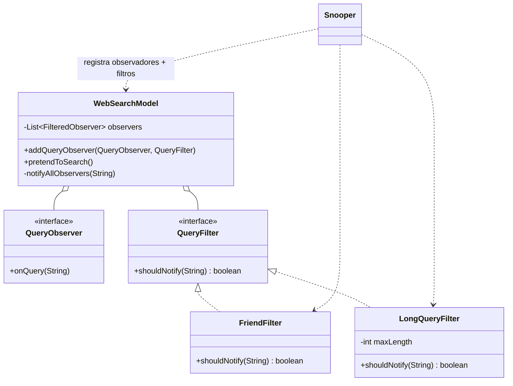

# Padrão Strategy — Pesquisa na Web (websearch)

Lista Avaliativa I — Padrões de Projetos Orientados a Objetos.

O `WebSearchModel` lê `data/Hamlet.txt` e trata cada linha como uma consulta. Cada observador
é registrado **junto com um filtro** (a *Strategy*) que decide se ele deve ou não ser notificado.
O modelo só conhece a interface `QueryFilter`, nunca as implementações concretas.

## Papéis do padrão

| Papel no Strategy | Classe |
|---|---|
| Contexto | `WebSearchModel` |
| Estratégia (interface) | `WebSearchModel.QueryFilter` |
| Estratégias concretas | `FriendFilter`, `LongQueryFilter` |
| Cliente | `Snooper` |



## Como executar (a partir da raiz do repositório)

```bash
javac -encoding UTF-8 -d out websearch/*.java
java -cp out Main
```

Trecho da saída:

```
Oh Yes!     Friends to this ground.
So long     Enter KING CLAUDIUS, QUEEN GERTRUDE, HAMLET, POLONIUS, LAERTES, VOLTIMAND, CORNELIUS, Lords, and Attendants
Oh Yes!     And let thine eye look like a friend on Denmark.
...
```

## Uso de IA
Prompts, tutorial e ajustes estão em [PROMPTS.md](PROMPTS.md). A evolução da solução pode ser
lida no histórico de commits (`git log`): um commit por passo do tutorial + um commit por ajuste.
